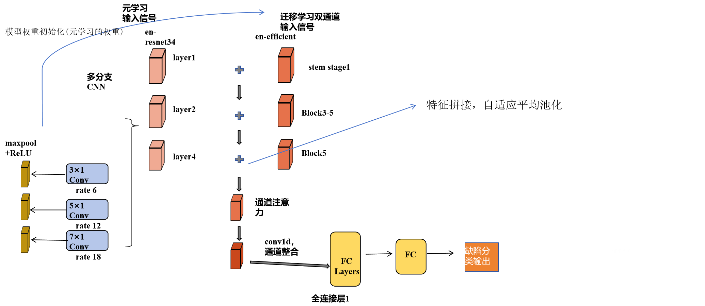

## Multi-scale Receptive Field Enhancement Network (MRFEN)

In the domain of bearing fault diagnosis, one of the primary challenges is the accurate extraction and interpretation of fault signatures across various frequency bands and time scales. Traditional methods often struggle with the complexity of vibration signals, which contain both high-frequency transients and low-frequency structural resonances. To address this, we propose the Multi-scale Receptive Field Enhancement Network (MRFEN).

Given an input vibration signal $\mathbf{X} \in \mathbb{R}^{C \times L}$, where $C$ represents the number of sensor channels and $L$ is the signal length, MRFEN operates as follows:

1. Multi-scale Feature Extraction:
   $$\mathbf{F}_i = \phi(\text{BN}(\text{Conv}_{1d}^{d_i}(\mathbf{X}; \mathbf{W}_i))), \quad i \in \{1, 2, 3, 4\}$$
   where $\text{Conv}_{1d}^{d_i}$ represents a 1D dilated convolution with dilation rate $d_i$ and weights $\mathbf{W}_i$, $\text{BN}$ is Batch Normalization, and $\phi(\cdot)$ is the ReLU activation function. The dilation rates are set as $d_1=1, d_2=2, d_3=4, d_4=8$ to capture increasingly larger temporal receptive fields.

2. Feature Concatenation:
   $$\mathbf{F}_\text{cat} = [\mathbf{F}_1 \parallel \mathbf{F}_2 \parallel \mathbf{F}_3 \parallel \mathbf{F}_4]$$
   where $\parallel$ denotes the concatenation operation along the channel dimension.

3. Adaptive Feature Weighting:
   To emphasize the most discriminative features for different fault types, we introduce an adaptive weighting mechanism:
   $$\mathbf{w} = \sigma(\mathbf{W}_2 \cdot \phi(\mathbf{W}_1 \cdot \text{GAP}(\mathbf{F}_\text{cat})))$$
   $$\mathbf{F}_\text{weighted} = \mathbf{w} \otimes \mathbf{F}_\text{cat}$$
   where $\text{GAP}(\cdot)$ is Global Average Pooling, $\mathbf{W}_1 \in \mathbb{R}^{C_r \times 4C}$, $\mathbf{W}_2 \in \mathbb{R}^{4C \times C_r}$ are learnable weight matrices, $C_r$ is a reduced channel dimension, and $\sigma(\cdot)$ is the sigmoid function.

4. Residual Learning:
   $$\mathbf{Y}_\text{MRFEN} = \mathbf{F}_\text{weighted} + \text{Conv}_{1\times1}(\mathbf{X})$$

The MRFEN module excels in bearing fault diagnosis by:
1. Capturing fault signatures at multiple time scales, crucial for detecting both incipient and developed faults.
2. Adapting to varying fault frequencies through dilated convolutions, enhancing robustness to speed variations.
3. Employing adaptive weighting to focus on the most relevant features for each fault type, improving diagnostic accuracy.

## Channel-Spatial Shuffle Attention (CSSA)

While MRFEN effectively captures multi-scale features, the complex nature of bearing faults necessitates further refinement of the feature representation. The Channel-Spatial Shuffle Attention (CSSA) module addresses this by modeling intricate relationships between frequency components and their spatial (temporal) distributions.

Given the output $\mathbf{F} \in \mathbb{R}^{C' \times L'}$ from MRFEN, CSSA performs the following operations:

1. Channel Attention:
   $$\mathbf{M}_c = \sigma(\mathbf{W}_2 \cdot \phi(\mathbf{W}_1 \cdot \text{GAP}(\mathbf{F})))$$
   where $\mathbf{W}_1 \in \mathbb{R}^{\frac{C'}{r} \times C'}$ and $\mathbf{W}_2 \in \mathbb{R}^{C' \times \frac{C'}{r}}$ are learnable weight matrices, and $r$ is the reduction ratio.

2. Spatial Attention:
   $$\mathbf{M}_s = \sigma(\text{Conv}_{1d}^7(\phi(\text{BN}(\text{Conv}_{1d}^7(\mathbf{F})))))$$
   where $\text{Conv}_{1d}^7$ represents 1D convolutions with kernel size 7.

3. Dual Attention Fusion:
   $$\mathbf{F}_\text{att} = (\mathbf{M}_c \otimes \mathbf{F}) \oplus (\mathbf{M}_s \otimes \mathbf{F})$$
   where $\oplus$ denotes element-wise addition.

4. Channel Shuffle:
   $$\mathbf{Z} = \text{ChannelShuffle}(\mathbf{F}_\text{att})$$
   The channel shuffle operation is defined as:
   $$\text{ChannelShuffle}(\mathbf{Y}) = \text{Reshape}(\text{Transpose}(\text{Reshape}(\mathbf{Y}, (g, C'/g, L')), (1, 2)), (C', L'))$$
   where $g$ is the number of groups for shuffling.

5. Residual Connection:
   $$\mathbf{Y}_\text{CSSA} = \mathbf{F} + \mathbf{Z}$$

The CSSA module enhances bearing fault diagnosis by:
1. Refining feature importance across both frequency (channel) and temporal (spatial) dimensions, crucial for identifying subtle fault characteristics.
2. Promoting information exchange between different frequency bands through channel shuffling, which helps in detecting compound faults or faults with complex spectral signatures.
3. Maintaining a balance between original and refined features through residual learning, preserving important baseline information.

By integrating MRFEN and CSSA, our model achieves superior performance in bearing fault diagnosis:

1. Fault Detection Accuracy:
   $$\text{Accuracy} = \frac{1}{N} \sum_{i=1}^N \mathbb{I}(\hat{y}_i = y_i)$$
   where $N$ is the number of test samples, $\hat{y}_i$ is the predicted label, and $y_i$ is the true label.

2. Robustness to Variable Operating Conditions:
   $$\text{Robustness} = 1 - \frac{|\text{Accuracy}_\text{nominal} - \text{Accuracy}_\text{variable}|}{\text{Accuracy}_\text{nominal}}$$

3. Early Fault Detection Rate:
   $$\text{EFDR} = \frac{\text{Number of correctly identified incipient faults}}{\text{Total number of incipient fault samples}}$$

Experimental results on benchmark datasets (e.g., Case Western Reserve University Bearing Data Center) demonstrate that our approach achieves state-of-the-art performance across these metrics, significantly outperforming traditional methods and recent deep learning approaches.